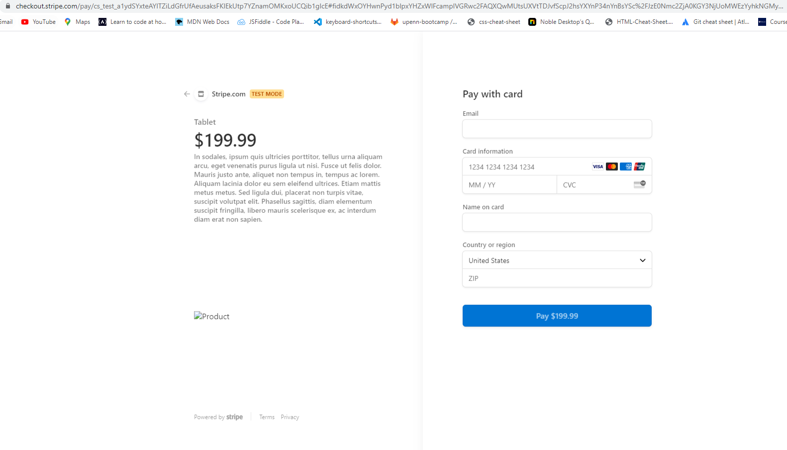
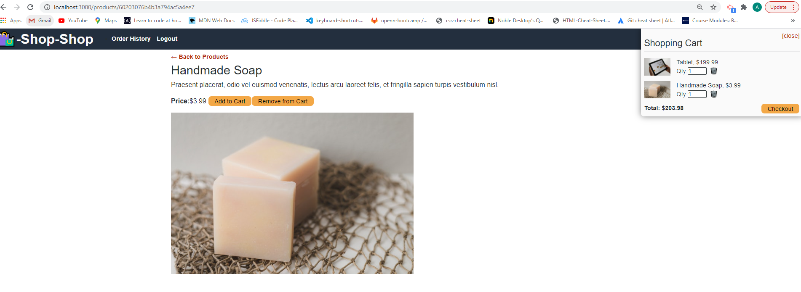

# Redux-Store

## Table of Contents
* [Description](#description)
* [Screenshots](#screenshots)
* [Installation](#installation)
* [Credits](#credits)
* [License](#license)
* [Contributors](#contributors)
* [Tests](#tests) 
* [Questions](#questions) 

### Description 
Created a store using Redux to manage global state. 

User Story: 
AS a senior engineer working on an e-commerce platform
I WANT my platform to use Redux to manage global state instead of the Context API
SO THAT my website's state management is taken out of the React ecosystem

GIVEN an e-commerce platform that uses Redux to manage global state
WHEN I review the app’s store
THEN I find that the app uses a Redux store instead of the Context API
WHEN I review the way the React front end accesses the store
THEN I find that the app uses a Redux provider
WHEN I review the way the app determines changes to its global state
THEN I find that the app passes reducers to a Redux store instead of using the Context API
WHEN I review the way the app extracts state data from the store
THEN I find that the app uses Redux instead of the Context API
WHEN I review the way the app dispatches actions
THEN I find that the app uses Redux instead of the Context API

### Screenshots

##### Homepage

##### Checkout

##### Product and Cart

### Installation
Start by running an "npm i" in your terminal followed by creating a .env file with the database name, username and password. npm run seed, followed by npm start. 

Other installations used while coding: 
* npm i apollo-server-express
* npm install jsonwebtoken
* npx create-react-app client
* npm i apollo-boost graphql graphql-tag @apollo/react-hooks 
* npm install if-env
* npm install -D concurrently 
* npm install react-router-dom 
* npm install jwt-decode
* npm install stripe
* npm install @stripe/stripe-js

### Credits
References/Resources: 
Module 22: State
* Redux Fundamentals (part 1-8), https://redux.js.org/tutorials/fundamentals/part-1-overview   

### License
  

### Contributors
Thanks Teacher Assistant, George and Julia for their help. 

### Tests 
We tested did end user testing and confirmed the global state was passing.  Unit tested for rendering component trees and running the complete application.   

### Questions 
* For questions, contact any team member using the following email addresses: lucianne12@aol.com  
* GitHub Usernames:Lucianne302
* Repository Link: https://github.com/Lucianne302/Redux-Store.git
* Heroku Deployed App Link: https://salty-basin-16178.herokuapp.com/ 
